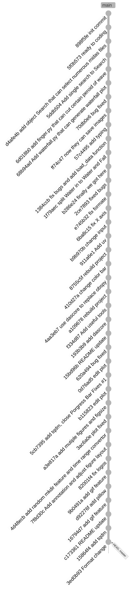

# 2026 INTREN
A project aim to process DAS (Distributed Acoustic Sensing, 分散式光纖聲學感測) data. Specially designed for MiDAS data.

## Features
- Read MiniSEED data
- Wave and waterfall plot
- GIF images of waterfall and wave

## Installation
### pip
```bash
pip install -e .
```

### uv
```bash
uv sync
```

## Usage


## Project Structure
```bash
.
├── src/
│   ├── load/   # Load MiniSEED or CSV data
│   ├── plot/   # Generate figure
│   └── utils/  # Other tools
├── main.py     # Directly run the program
└── __main__.py # Allow users to use CLI interface
```

## Major Logs
- 2026/07/28, Search and wave cut feature
- 2026/07/29, Waterfall plot feature
- 2026/08/04, Use [dascore](https://github.com/DASDAE/dascore) to replace [obspy](https://github.com/obspy/obspy), inspired by [ralin3233](https://github.com/ralin3233/das-processing-pipeline)
- 2026/08/09, GIF feature

## Git Graph

